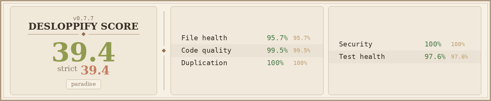

# Paradise

**Spatial canvas for AI agent fleet management.**

Spawn, connect, monitor, and chat with multiple AI agent containers — each one a specialized "nanobot" — on an infinite visual canvas. Give any agent a Genesis prompt ("Proxmox server manager", "weather dashboard") and it writes its own identity, dashboards, and API scripts.

## Architecture

```
Browser (Next.js 15 / React Flow)
       │
       │ REST + WebSocket
       ▼
 FastAPI Backend (Python 3.12)
  ├── Canvas API    /api/canvas
  ├── Nodes API     /api/nodes
  ├── Edges API     /api/edges
  └── Chat Relay    /api/nodes/{id}/chat  ← WebSocket bridge
       │                │
       │ SQLAlchemy     │ Docker SDK (unix socket)
       ▼                ▼
 PostgreSQL 16     Docker Engine
  nodes              ├── nanobot-{id}  ← WS :18790
  edges              ├── nanobot-{id}  ← WS :18790
  canvas_state       └── ...
  chat_messages
```

Chat uses a three-layer WebSocket relay: browser → FastAPI → nanobot container. Messages are persisted to the database even when the frontend is disconnected.

## Features

- **Infinite canvas** — React Flow with snap-to-grid, minimap, and pan/zoom; viewport persisted to PostgreSQL
- **Nanobot lifecycle** — create, delete, restart, rebuild, and clone containers from the canvas
- **Genesis** — describe what an agent should be; it writes its own `identity.json`, HTML dashboards, and `api.py` scripts
- **Node inspector** — side drawer with tabs: Chat, Object (dashboard/config/commands/children), Agent files, Config, Logs, Info/Stats
- **PARADISE Bridge API** — JavaScript API injected into agent-rendered iframes: `exec()`, `run()`, `readFile()`, `writeFile()`, `rename()`, `setStatus()`
- **Agent status signaling** — agents call `setStatus(ok|warning|error)` to update the status dot on the canvas
- **Global settings** — default nanobot config and agent file templates applied to every new container
- **Dark theme** — CSS custom properties, system-ui font stack

## Quick Start

### Prerequisites

- Docker and Docker Compose
- [nanobot](https://github.com/search?q=nanobot) source at `/root/nanobot` on the host (required by the `nanobot-image` build stage in `docker-compose.yml`)

### Run

```bash
docker compose up --build
```

| Service  | URL                   |
|----------|-----------------------|
| Frontend | http://localhost:3000  |
| Backend  | http://localhost:8000  |
| Postgres | localhost:5432         |

On first boot the backend creates all database tables and reconciles any existing container state.

## Environment Variables

| Variable | Default | Description |
|---|---|---|
| `DATABASE_URL` | `postgresql+asyncpg://paradise:paradise@db:5432/paradise` | Async SQLAlchemy connection string |
| `DOCKER_HOST` | `unix:///var/run/docker.sock` | Docker daemon socket path |
| `PARADISE_NETWORK` | `paradise_paradise` | Docker network nanobots attach to |
| `NANOBOT_IMAGE` | `paradise-nanobot` | Image tag for spawning nanobot containers |
| `NEXT_PUBLIC_API_URL` | *(auto-detected from browser)* | Override backend API base URL |
| `PARADISE_WS_PORT` | `18790` | WebSocket port inside nanobot containers |

## Project Structure

```
paradise/
├── docker-compose.yml          # Orchestrates all services
├── frontend/                   # Next.js 15 + React 19 + TypeScript
│   └── src/
│       ├── app/                # App Router pages
│       ├── components/         # Canvas, NodeDrawer, ChatTab, HtmlTab, ...
│       ├── hooks/              # useCanvasSync, useChatSocket, useAsyncForm
│       ├── store/              # Zustand canvas store
│       └── types.ts            # Shared TypeScript types
├── backend/                    # FastAPI + SQLAlchemy 2.0 (async)
│   └── app/
│       ├── main.py             # App entrypoint + startup reconciliation
│       ├── db.py               # Models: Node, Edge, CanvasState, ChatMessage
│       ├── docker_ops.py       # Container lifecycle (create, stop, clone, file I/O)
│       └── routes/             # canvas, nodes, edges, chat
└── nanobot/                    # Nanobot container image
    ├── Dockerfile
    └── server.py               # WebSocket server on :18790
```

## PARADISE Bridge API

HTML files rendered inside node inspector iframes have access to a `PARADISE` global object:

```js
// Run a shell command in the container (no LLM, fast)
const output = await PARADISE.run("python3 api.py status");

// Send a prompt to the node's AI agent
const answer = await PARADISE.exec("Summarize recent logs");

// Read / write workspace files
const soul = await PARADISE.readFile("SOUL.md");
await PARADISE.writeFile("dashboard.html", updatedHtml);

// Update the node's name on the canvas
await PARADISE.rename("My Proxmox Agent");

// Set the status dot color on the canvas node
await PARADISE.setStatus("ok", "All systems nominal");
```

## Workspace Files

Each nanobot container has a workspace at `/root/.nanobot/workspace/`:

| File | Purpose |
|---|---|
| `SOUL.md` | Agent personality, values, and communication style |
| `AGENTS.md` | Operational instructions and tool definitions |
| `USER.md` | User profile — name, timezone, preferences |
| `HEARTBEAT.md` | Periodic tasks checked every 30 minutes |
| `TOOLS.md` | Custom tool definitions |
| `identity.json` | Agent identity (emoji, color, tabs) — written by Genesis |
| `dashboard.html` | Main Object tab dashboard |
| `config.html` | Object config sub-tab |
| `commands.html` | Object commands sub-tab |
| `children.html` | Object children sub-tab |
| `api.py` | Python API script called by dashboards via `PARADISE.run()` |
